# P-HBCC-2M: đặc tả kiến trúc và hướng dẫn cài đặt

> Trạng thái: **đã dừng làm hướng chính** vì kết quả thực nghiệm chưa hiệu quả.
> Mã và config được giữ để tái lập, nhưng pipeline/report mặc định đã quay lại
> HBCC-Small/Medium cũ với augmentation công bằng cho toàn bộ đối chứng.
>
> Mục tiêu: giữ tổng số tham số dưới `2.0M` trên cả CIFAR-10 và CIFAR-100, đồng thời giảm rủi ro mất độ chính xác so với việc thay toàn bộ toán tử HBCC hiện tại.

## 1. Kết luận thiết kế

Kiến trúc được đề xuất có tên **P-HBCC-2M** (*Progressive-capacity Hybrid Context Cluster, dưới 2 triệu tham số*). Đây là một biến thể bảo thủ của HBCC hiện tại:

- Giữ `RGB + XY`, Context Cluster, multi-head, hard assignment và aggregate-dispatch của bài báo gốc.
- Giữ block hybrid, nhánh cục bộ, channel shuffle và residual hiện có trong repository.
- Tăng dung lượng chủ yếu ở Stage 3, nơi đặc trưng đã có ngữ nghĩa cao và bản CoC gốc cũng tập trung phần lớn độ sâu.
- Giới hạn Stage 4 ở một block và giảm `MLP ratio` xuống `2.5`, vì chi phí tham số tại stage có số kênh lớn tăng gần theo `C²`.
- Không thêm cơ chế cập nhật tâm lặp nhiều lần; bài báo gốc cho thấy lợi ích của hai lần cập nhật là rất nhỏ.

Điểm quan trọng cần trình bày trung thực trong report:

- Có thể **đảm bảo bằng kiểm tra tĩnh** rằng mô hình dưới `2M` tham số.
- Không thể đảm bảo trước độ chính xác chỉ từ thiết kế. Độ chính xác phải được xác nhận bằng huấn luyện nhiều seed với cùng công thức huấn luyện cho các mô hình so sánh.

## 2. Cơ sở từ Context Cluster gốc

Thiết kế dựa trên các quan sát trong [Image as Set of Points](./2303.01494v1.pdf):

1. **Tọa độ là thành phần thiết yếu.** Ảnh được biểu diễn như tập điểm có thuộc tính màu và vị trí. Vì vậy P-HBCC-2M giữ hai kênh `X, Y`; không quay lại thiết lập chỉ dùng RGB.
2. **Context Cluster tạo phần tăng chính về độ chính xác.** Trong ablation cộng dồn trên ImageNet-1K của bài báo, cấu hình chỉ dùng position đạt Top-1 `74.2`, thêm Context Cluster một head đạt `76.6`, và multi-head đạt `77.5`. Do đó không nên loại bỏ Context Cluster hoặc multi-head chỉ để giảm tham số.
3. **Region partition là đánh đổi bộ nhớ/tính toán.** Bỏ partition có thể cải thiện độ chính xác nhưng làm chi phí tăng mạnh. P-HBCC-2M giữ partition ở hai stage đầu và dùng global region ở hai stage sau.
4. **Độ sâu nên tập trung ở Stage 3.** Các biến thể CoC chính đều đặt nhiều block nhất ở Stage 3. P-HBCC-2M dùng lịch độ sâu `[2, 2, 4, 1]`.
5. **Cập nhật tâm lặp không đáng chi phí.** Bài báo báo cáo mức tăng rất nhỏ khi cập nhật tâm hai lần, nên đề xuất không thêm vòng lặp này.

## 3. Sơ đồ tổng thể

```mermaid
flowchart LR
    I["RGB<br/>3 × 32 × 32"] --> XY["CoordinateAugment<br/>RGB + XY<br/>5 × 32 × 32"]
    XY --> Stem["Stem<br/>Conv 3×3, s=2<br/>56 × 16 × 16"]
    Stem --> S1["Stage 1<br/>2 Hybrid blocks<br/>56 × 16 × 16"]
    S1 --> D1["Reducer 1<br/>Conv 3×3, s=2<br/>88 × 8 × 8"]
    D1 --> S2["Stage 2<br/>2 Hybrid blocks<br/>88 × 8 × 8"]
    S2 --> D2["Reducer 2<br/>Conv 3×3, s=2<br/>176 × 4 × 4"]
    D2 --> S3["Stage 3<br/>4 Cluster blocks<br/>176 × 4 × 4"]
    S3 --> D3["Reducer 3<br/>Conv 3×3, s=2<br/>232 × 2 × 2"]
    D3 --> S4["Stage 4<br/>1 Cluster block<br/>232 × 2 × 2"]
    S4 --> H["BN → GAP → Linear<br/>num_classes"]
```



Luồng kích thước tensor:

```text
RGB                 : B ×   3 × 32 × 32
RGB + XY            : B ×   5 × 32 × 32
Stem / Stage 1      : B ×  56 × 16 × 16
Reducer 1 / Stage 2 : B ×  88 ×  8 ×  8
Reducer 2 / Stage 3 : B × 176 ×  4 ×  4
Reducer 3 / Stage 4 : B × 232 ×  2 ×  2
BN + GAP            : B × 232
Classifier          : B × num_classes
```

## 4. Đặc tả kiến trúc chính xác

| Thành phần | Kích thước đầu ra | Mode | Số block | Kênh `C` | Nhánh local | Tỉ lệ local | Heads × head dim | Proposal | Fold | MLP ratio |
|---|---:|---|---:|---:|---|---:|---:|---:|---:|---:|
| Stem | `16 × 16` | Conv | — | 56 | — | — | — | — | — | — |
| Stage 1 | `16 × 16` | Hybrid | 2 | 56 | LBPConv | 0.5 | `2 × 16` | `2 × 2` | `4 × 4` | 3.0 |
| Stage 2 | `8 × 8` | Hybrid | 2 | 88 | DWConv | 0.5 | `2 × 16` | `2 × 2` | `2 × 2` | 3.0 |
| Stage 3 | `4 × 4` | Cluster | 4 | 176 | — | 0.0 | `4 × 16` | `2 × 2` | `1 × 1` | 3.0 |
| Stage 4 | `2 × 2` | Cluster | 1 | 232 | — | 0.0 | `4 × 16` | `2 × 2` | `1 × 1` | 2.5 |
| Head | `1 × 1` | `BN → GAP → FC` | — | 232 | — | — | — | — | — | — |

Các tham số chung:

```yaml
use_coord: true
embed_dims: [56, 88, 176, 232]
depths: [2, 2, 4, 1]
mlp_ratios: [3.0, 3.0, 3.0, 2.5]
heads: [2, 2, 4, 4]
head_dim: [16, 16, 16, 16]
proposals: [[2, 2], [2, 2], [2, 2], [2, 2]]
folds: [[4, 4], [2, 2], [1, 1], [1, 1]]
similarities: [cosine, cosine, cosine, cosine]
stage_modes: [hybrid, hybrid, cluster, cluster]
local_branches: [lbpconv, dwconv, identity, identity]
local_ratios: [0.5, 0.5, 0.0, 0.0]
channel_shuffle: [true, true, false, false]
norm: bn
stem_patch_size: 3
stem_stride: 2
stem_padding: 1
down_patch_size: 3
down_stride: 2
down_padding: 1
drop_rate: 0.0
drop_path_rate: 0.10
```

Repository hiện đã cố định các thành phần sau trong mã nguồn:

- Stem và ba reducer: `Conv 3×3, stride 2, padding 1 → BatchNorm → GELU`.
- Block dùng pre-normalization bằng BatchNorm.
- MLP dùng GELU.
- LayerScale được khởi tạo bằng `1e-5`.
- DropPath tăng tuyến tính từ `0` đến `0.10` qua tổng cộng 9 block.
- Head dùng BatchNorm, global average pooling và fully connected layer.

Không thêm khóa `layer_scale` hoặc `activation` vào YAML hiện tại, vì hàm khởi tạo `HBCCNet` chưa nhận hai khóa này.

## 5. Cấu tạo chi tiết của một Hybrid block

Với đầu vào `X ∈ R^(B×C×H×W)`, block thực hiện:

```text
U  = BN(X)
[Uc, Ul] = Split(U)
Zc = ContextCluster(Uc)
Zl = LocalBranch(Ul)
Z  = Conv1x1(ChannelShuffle(Concat(Zc, Zl)))
X1 = X + DropPath(γ1 ⊙ Z)
Y  = X1 + DropPath(γ2 ⊙ MLP(BN(X1)))
```

Trong đó `γ1` và `γ2` là hai vector LayerScale học được, khởi tạo ở `1e-5`.

### 5.1. Stage 1

- `C = 56`, chia thành `28` kênh cluster và `28` kênh local.
- Nhánh cluster chiếu `28 → 32` cho `f` và `v`, tương ứng `2 heads × 16 dimensions`; sau aggregate-dispatch chiếu `32 → 28`.
- Nhánh LBP tạo 8 đáp ứng cố định trên mỗi kênh: depthwise `28 → 224`, sau đó BatchNorm, GELU và pointwise `224 → 28`.
- Hai nhánh được nối lại, shuffle theo 2 group và fuse bằng `Conv 1×1: 56 → 56`.
- MLP có hidden dimension `56 × 3 = 168`.

LBPConv được đưa vào như một prior cạnh/texture. Cài đặt này dùng 8 kernel sai phân `3×3` cố định trên mỗi kênh, không phải phép mã hóa LBP nhị phân chuẩn. Hai block Stage 1 chứa tổng cộng `4,032` trọng số không huấn luyện; đây là lý do tổng tham số lớn hơn tham số trainable đúng `4,032`.

### 5.2. Stage 2

- `C = 88`, chia thành `44` kênh cluster và `44` kênh local.
- Nhánh cluster dùng nội bộ `2 × 16 = 32` chiều.
- Nhánh local dùng depthwise `3×3` rồi pointwise `1×1`.
- Hai nhánh được concat, channel shuffle và fuse `1×1`.
- MLP có hidden dimension `88 × 3 = 264`.

### 5.3. Stage 3

- Toàn bộ `176` kênh đi qua Context Cluster; không còn nhánh local và không cần fuse.
- Dùng `4 heads × 16 dimensions = 64` chiều nội bộ.
- Có 4 block, nhiều nhất trong mô hình.
- MLP có hidden dimension `176 × 3 = 528`.

### 5.4. Stage 4

- Toàn bộ `232` kênh đi qua Context Cluster.
- Dùng `4 heads × 16 dimensions = 64` chiều nội bộ.
- Chỉ dùng một block để tránh tăng mạnh số tham số.
- MLP ratio giảm còn `2.5`, hidden dimension `232 × 2.5 = 580`.

## 6. Context Cluster bên trong mỗi head

Cho feature projection `F` và value projection `V`:

1. Feature map được chia thành các region theo `fold`.
2. Trong mỗi region, `AdaptiveAvgPool2d(2, 2)` sinh 4 tâm đề xuất.
3. Tính cosine similarity giữa tâm `c_i` và điểm `p_j`:

   ```text
   r_ij = cosine(c_i, p_j)
   s_ij = sigmoid(β + α · r_ij)
   ```

4. Mỗi điểm được gán cứng vào đúng một tâm bằng `argmax`; trọng số similarity của các tâm còn lại được đặt về 0.
5. Giá trị của cluster được tổng hợp:

   ```text
   g_i = (v_center_i + Σ_j m_ij s_ij v_j) / (1 + Σ_j m_ij s_ij)
   ```

6. Cluster feature được dispatch ngược về điểm:

   ```text
   o_j = Σ_i m_ij s_ij g_i
   ```

7. Các head được nối theo chiều kênh và chiếu về số kênh đầu ra.

Lịch partition cụ thể:

| Stage | Feature map | Fold | Số region | Kích thước mỗi region | Tâm/region |
|---|---:|---:|---:|---:|---:|
| 1 | `16 × 16` | `4 × 4` | 16 | `4 × 4` | 4 |
| 2 | `8 × 8` | `2 × 2` | 4 | `4 × 4` | 4 |
| 3 | `4 × 4` | `1 × 1` | 1 | `4 × 4` | 4 |
| 4 | `2 × 2` | `1 × 1` | 1 | `2 × 2` | 4 |

Lưu ý: `heads × head_dim` là kích thước projection nội bộ, không phải phép chia trực tiếp số kênh đầu vào. Vì vậy `C` không bắt buộc chia hết cho số head trong cài đặt hiện tại.

## 7. Ngân sách tham số và phép tính

Các số dưới đây đã được đo bằng chính implementation hiện tại với đầu vào `32×32`:

| Mô hình | Số lớp | Tổng params | Trainable params | Kích thước model | Phép tính được fvcore đếm |
|---|---:|---:|---:|---:|---:|
| HBCC-Small hiện tại | 10 | 1,538,618 | 1,535,162 | 5.89 MiB | 35.88M |
| **P-HBCC-2M** | 10 | **1,953,056** | **1,949,024** | **7.48 MiB** | **47.82M** |
| HBCC-Medium hiện tại | 10 | 2,840,862 | 2,836,254 | 10.87 MiB | 60.65M |
| **P-HBCC-2M** | 100 | **1,974,026** | **1,969,994** | **7.56 MiB** | **47.84M** |

Trên CIFAR-100, P-HBCC-2M:

- Vẫn dưới `2,000,000` tham số với classifier 100 lớp.
- Ít hơn HBCC-Medium khoảng `31%` tham số.
- Nhiều hơn HBCC-Small khoảng `27%` tham số, đổi lại có thêm dung lượng ở Stage 3 và width lớn hơn.

Phân rã `1,974,026` tham số của cấu hình CIFAR-100:

| Thành phần | Params | Tỉ lệ xấp xỉ |
|---|---:|---:|
| Stem | 2,632 | 0.1% |
| Stage 1 | 68,284 | 3.5% |
| Reducer 1 | 44,528 | 2.3% |
| Stage 2 | 124,036 | 6.3% |
| Reducer 2 | 139,744 | 7.1% |
| Stage 3 | 886,856 | 44.9% |
| Reducer 3 | 367,952 | 18.6% |
| Stage 4 | 316,230 | 16.0% |
| Final BN | 464 | <0.1% |
| Classifier 100 lớp | 23,300 | 1.2% |

Bảng này cho thấy capacity được tập trung chủ yếu ở Stage 3. Reducer 3 và Stage 4 vẫn chiếm ngân sách đáng kể do width lớn, là lý do không tăng thêm depth ở cuối mạng.

`fvcore` không đếm đầy đủ cosine normalization, sigmoid, scatter, sum và một số phép toán element-wise. Vì vậy cột cuối là **số phép tính được công cụ đếm/cận dưới**, không nên mô tả như tổng FLOPs tuyệt đối trong bài báo.

Giá trị MiB ở bảng trên được tính từ parameters và buffers trong bộ nhớ; nó không phải kích thước chính xác của file checkpoint có kèm optimizer state và metadata.

## 8. Vì sao cấu hình này có rủi ro accuracy thấp hơn một kiến trúc hoàn toàn mới

P-HBCC-2M không dựa vào giả định rằng toán tử rẻ hơn chắc chắn sẽ học tốt hơn. Nó giữ nguyên đường truyền đã có checkpoint và chỉ tái phân bổ capacity:

- Từ HBCC-Small `[48, 80, 160, 224]`, tăng width vừa phải thành `[56, 88, 176, 232]`.
- Từ depth `[2, 2, 3, 1]`, chỉ thêm một block vào Stage 3 để thành `[2, 2, 4, 1]`.
- Không giảm số lần gọi Context Cluster.
- Không thay cosine bằng một similarity chưa được kiểm chứng.
- Không bỏ XY hoặc multi-head, là hai thành phần có bằng chứng ablation từ CoC gốc.
- Không làm Stage 4 sâu hơn; MLP tại đây đắt vì `C = 232`.

Đây là lập luận thiết kế, không phải bằng chứng thực nghiệm. Trong report, nên dùng từ “đề xuất”, “kỳ vọng” và “giả thuyết”, cho đến khi có kết quả nhiều seed.

## 9. Cài đặt trong repository hiện tại

### 9.1. Chuẩn bị môi trường

Từ thư mục gốc của repository:

```powershell
conda env update -n CoC -f environment.yml
conda activate CoC
python -m pip install -e .
python -m pytest
```

Nếu `conda activate` không ổn định, dùng trực tiếp interpreter:

```powershell
& D:\Anaconda\envs\CoC\python.exe -m pytest
```

### 9.2. Cài đặt hiện tại

Kiến trúc đã được cài bằng hai lớp bảo vệ:

- Factory `phbcc_2m` trong `lightweight_hbcc/models/hbcc.py` là đặc tả mặc định trong mã nguồn.
- `configs/hbcc_accuracy_phbcc_2m.yaml` khai báo đầy đủ contract kiến trúc và được unit test khóa theo từng trường.

Factory đã được thêm vào registry, vì vậy cấu hình dùng:

```yaml
_base_: recipes/cifar_coc_paper_inspired.yaml

experiment:
  name: hbcc_accuracy_phbcc_2m

model:
  name: phbcc_2m
  num_classes: 10
  use_coord: true
  embed_dims: [56, 88, 176, 232]
  depths: [2, 2, 4, 1]
  mlp_ratios: [3.0, 3.0, 3.0, 2.5]
  heads: [2, 2, 4, 4]
  head_dim: [16, 16, 16, 16]
  proposals: [[2, 2], [2, 2], [2, 2], [2, 2]]
  folds: [[4, 4], [2, 2], [1, 1], [1, 1]]
  similarities: [cosine, cosine, cosine, cosine]
  stage_modes: [hybrid, hybrid, cluster, cluster]
  local_branches: [lbpconv, dwconv, identity, identity]
  local_ratios: [0.5, 0.5, 0.0, 0.0]
  channel_shuffle: [true, true, false, false]
  norm: bn
  stem_patch_size: 3
  stem_stride: 2
  stem_padding: 1
  down_patch_size: 3
  down_stride: 2
  down_padding: 1
  drop_rate: 0.0
  drop_path_rate: 0.10
```

`_base_` được giải quyết tương đối theo vị trí file. Recipe chung chứa toàn bộ phần `data` và `train`, tránh sao chép rồi vô tình làm các mô hình dùng augmentation khác nhau.

### 9.3. Kiểm tra shape và forward

```powershell
& D:\Anaconda\envs\CoC\python.exe tools\shape_trace.py `
  --config configs\hbcc_accuracy_phbcc_2m.yaml
```

Kết quả cuối phải có logits dạng:

```text
batch × 10
```

Có thể chạy smoke training trước khi huấn luyện đầy đủ:

```powershell
& D:\Anaconda\envs\CoC\python.exe tools\train.py `
  --config configs\hbcc_accuracy_phbcc_2m.yaml `
  --output runs_smoke `
  --override train.epochs=1 `
  --limit-train-batches 2 `
  --limit-val-batches 2 `
  --limit-test-batches 2
```

### 9.4. Huấn luyện CIFAR-10

```powershell
& D:\Anaconda\envs\CoC\python.exe tools\train.py `
  --config configs\hbcc_accuracy_phbcc_2m.yaml `
  --output runs_accuracy
```

Checkpoint tốt nhất sẽ nằm tại:

```text
runs_accuracy/hbcc_accuracy_phbcc_2m/best.pth
```

### 9.5. Huấn luyện CIFAR-100

Cần đổi **cả dataset và số lớp**:

```powershell
& D:\Anaconda\envs\CoC\python.exe tools\train.py `
  --config configs\hbcc_accuracy_phbcc_2m.yaml `
  --output runs_accuracy_cifar100 `
  --override data.name=cifar100 `
  --override model.num_classes=100 `
  --override experiment.name=hbcc_accuracy_phbcc_2m_cifar100
```

Chỉ đổi `data.name` là chưa đủ, vì YAML gốc đã khai báo rõ `model.num_classes: 10`.

### 9.6. Benchmark

```powershell
& D:\Anaconda\envs\CoC\python.exe tools\benchmark.py `
  --config configs\hbcc_accuracy_phbcc_2m.yaml `
  --checkpoint runs_accuracy\hbcc_accuracy_phbcc_2m\best.pth `
  --output results\benchmark_phbcc `
  --batch-sizes 1 16 64 128 `
  --profile
```

Khi mục tiêu chính là accuracy và số tham số, vẫn nên báo cáo thêm MACs, latency batch 1, throughput và peak memory để tránh kết luận chỉ dựa trên parameter count.

## 10. Bộ so sánh công bằng đã cài đặt

Các config tại `configs/fair_comparison/cifar10` và `configs/fair_comparison/cifar100` vẫn hỗ trợ tám kiến trúc, nhưng ma trận report mặc định đã quay lại sáu mô hình cũ: ResNet-18, MobileNetV2, ShuffleNetV2, CoC CIFAR baseline, HBCC-Small và HBCC-Medium. HBCC-Small+ và P-HBCC-2M chỉ còn là artifact thử nghiệm tùy chọn.

Tất cả kế thừa **một** recipe duy nhất tại `configs/recipes/cifar_coc_paper_inspired.yaml`. Recipe tham khảo Context Cluster (ICLR 2023), Mục 4.1: horizontal flip, Random Erasing, MixUp, CutMix và label smoothing; RandomCrop là thích nghi cho CIFAR. RandAugment được tắt. Đây là protocol paper-inspired chứ không phải tái lập ImageNet nguyên bản vì dùng 200 epochs, batch 128 và không EMA. Runner kiểm tra `data`, `train` và metadata protocol phải giống hệt nhau trước khi khởi chạy:

```powershell
& D:\Anaconda\envs\CoC\python.exe tools\run_fair_comparison.py `
  --dataset cifar10 `
  --validate-only
```

Chạy bảng chính với một shared seed mặc định `17`:

```powershell
& D:\Anaconda\envs\CoC\python.exe tools\run_fair_comparison.py `
  --dataset cifar10 `
  --benchmark
```

Đổi thành `--dataset cifar100` để chạy bộ config 100 lớp. Thiết kế này có 6 mô hình × 1 seed × 200 epochs = 1.200 epoch-runs, giảm 90% so với ma trận mở rộng 8 × 5 × 300 = 12.000 epoch-runs. Mỗi run có hậu tố `_seed17`.

## 11. Giao thức đánh giá accuracy công bằng

### 11.1. Một protocol duy nhất

Với ngân sách giới hạn, report chỉ dùng bảng **architecture-controlled paper-inspired**. Cả sáu mô hình nhận cùng epoch, optimizer, augmentation, label smoothing, MixUp/CutMix và model-selection protocol. Không chạy thêm bảng Basic/Strong hoặc best-recipe; nếu có kết quả cũ từ recipe khác, không trộn chúng vào bảng chính.

### 11.2. Ma trận thí nghiệm tối thiểu

| ID | Kiến trúc | Vai trò |
|---|---|---|
| A | ResNet-18 | CNN tham chiếu phổ biến |
| B | MobileNetV2 | Baseline nhẹ theo số tham số |
| C | ShuffleNetV2 x1.0 | Baseline nhẹ gần HBCC-Small |
| D | CoC CIFAR baseline | Kiến trúc Context Cluster gốc |
| E | HBCC-Small | HBCC cũ, mô hình chính |
| F | HBCC-Medium | HBCC cũ, capacity lớn hơn |

HBCC-Small+ và P-HBCC-2M không thuộc bảng chính; chỉ chạy lại nếu cần tái lập lịch sử phát triển.

### 11.3. Số lần chạy và tiêu chí chấp nhận

- Chạy đúng seed `17` cho toàn bộ sáu mô hình; không lập bảng chính nếu thiếu bất kỳ run nào.
- Giữ nguyên train/validation/test split giữa các mô hình.
- Chọn checkpoint theo validation; chỉ đánh giá official test split bằng checkpoint tốt nhất.
- Báo cáo accuracy và chênh lệch trực tiếp tại seed 17.
- Không báo mean, standard deviation, confidence interval hoặc ý nghĩa thống kê từ một seed.

Các tiêu chí P-HBCC dưới đây chỉ còn là tiêu chí lịch sử, không dùng để kết luận report:

```text
params_total(CIFAR-100) < 2,000,000
mean_accuracy(P-HBCC-2M) > mean_accuracy(HBCC-Small)
P-HBCC-2M nằm trên hoặc gần Pareto frontier accuracy/parameters của năm mô hình
```

Khoảng accuracy `94.1–94.5%` trên CIFAR-10 và `74.2–74.8%` trên CIFAR-100 chỉ nên được xem là **mục tiêu thiết kế**, không được đưa vào bảng kết quả như số đo thực nghiệm.

Pipeline hiện đọc `train.seed`, seed Python, NumPy, PyTorch, CUDA và DataLoader worker/order. MixUp/CutMix dùng hai RNG riêng, nên stochastic depth của các kiến trúc khác nhau không làm lệch chuỗi augmentation cấp batch. Giữ `data.split_seed=42`, `train.seed=17` và `data.loader_seed=17` cho mọi mô hình. Lưu ý `adaptive_avg_pool2d_backward_cuda` của phiên bản PyTorch hiện tại chưa deterministic tuyệt đối; shared seed kiểm soát augmentation/order nhưng không bảo đảm hai run GPU bitwise-identical. Runner đánh dấu smoke/epoch override là protocol không canonical và chặn `--resume` vì pipeline hiện chưa phục hồi đầy đủ optimizer/scheduler/RNG state. Nếu job bị gián đoạn, chạy lại cùng lệnh: runner chỉ bỏ qua các run đã có đủ `config.yaml`, `best.pth`, `test_metrics.json` và khớp chính xác toàn bộ `data`, `train`, `protocol`; artifact dở dang hoặc lệch augmentation vẫn bị từ chối.

## 12. Các rủi ro và kiểm tra bắt buộc

1. **Fold phải chia hết feature map.** Lịch `[4×4, 2×2, 1×1, 1×1]` hợp lệ với kích thước `[16, 8, 4, 2]`.
2. **Mọi danh sách theo stage phải có đúng 4 phần tử.** Nếu thiếu phần tử, quá trình dựng model có thể lỗi index.
3. **Channel shuffle cần số kênh chẵn.** Các width `56` và `88` đều thỏa điều kiện.
4. **Stage 4 có 4 điểm và proposal `2×2` tạo 4 tâm.** Đây gần với trường hợp một tâm trên một điểm. Giữ nó trong cấu hình chính để ít thay đổi so với HBCC hiện tại, nhưng cần ablation riêng với proposal `1×1`.
5. **LBP chưa có bằng chứng từ bài CoC gốc.** Nó thuộc HBCC hiện tại, nên phải có ablation LBP so với DWConv trước khi khẳng định đóng góp.
6. **BatchNorm nhạy với batch nhỏ.** Batch huấn luyện `128` là hợp lý; nếu giảm mạnh batch size, cần đánh giá lại normalization.
7. **Không nhầm tổng params với trainable params.** LBP tạo `4,032` tham số cố định trong P-HBCC-2M.
8. **Không ghi MACs fvcore là FLOPs tuyệt đối.** Một số toán tử Context Cluster chưa được công cụ đếm.
9. **Tên experiment phải khác nhau.** Nếu dùng cùng output và cùng `experiment.name`, run sau có thể ghi đè artifact của run trước.

## 13. Checklist hoàn tất cài đặt

- [x] Tạo `configs/hbcc_accuracy_phbcc_2m.yaml` và factory `phbcc_2m`.
- [x] Chạy toàn bộ unit test.
- [x] Chạy `shape_trace.py` và kiểm tra chuỗi kích thước `16 → 8 → 4 → 2`.
- [x] Chạy forward/backward smoke training.
- [x] Kiểm tra tổng params CIFAR-10 là `1,953,056`.
- [x] Kiểm tra cấu hình 100 lớp có tổng params là `1,974,026`.
- [x] Benchmark static metrics và ghi rõ unsupported operators.
- [ ] Huấn luyện sáu mô hình của report cũ bằng cùng recipe paper-inspired.
- [ ] Hoàn tất seed `17` cho cả sáu mô hình ở 200 epochs.
- [ ] Báo cáo accuracy seed 17, parameter count và phép tính/latency; không suy diễn thống kê nhiều seed.
- [x] Loại P-HBCC-2M khỏi pipeline kết luận chính sau khi kết quả không hiệu quả.

## 14. Các file mã nguồn liên quan

- `lightweight_hbcc/models/hbcc.py`: dựng stem, 4 stage, reducer và classifier.
- `lightweight_hbcc/models/cluster.py`: Context Cluster, Hybrid block và MLP.
- `lightweight_hbcc/models/layers.py`: XY augmentation, PointReducer, DWConv, LBPConv và channel shuffle.
- `lightweight_hbcc/models/registry.py`: registry model.
- `lightweight_hbcc/config.py`: giải quyết `_base_` và hợp nhất recipe trung tâm.
- `lightweight_hbcc/data.py`: DataLoader generator và worker seeding.
- `lightweight_hbcc/engine.py`: global seeding và RNG MixUp/CutMix độc lập.
- `configs/hbcc_accuracy_phbcc_2m.yaml`: contract đầy đủ của P-HBCC-2M.
- `configs/recipes/cifar_coc_paper_inspired.yaml`: recipe công bằng duy nhất, lấy cảm hứng từ Context Cluster Mục 4.1.
- `configs/fair_comparison`: config đối chứng CIFAR-10 và CIFAR-100.
- `tools/shape_trace.py`: kiểm tra kích thước tensor.
- `tools/train.py`: huấn luyện và đánh giá.
- `tools/benchmark.py`: đo params, phép tính, latency, throughput và memory.
- `tools/run_fair_comparison.py`: preflight fairness và chạy shared seed 17.
- `tests/test_phbcc_and_fairness.py`: khóa kiến trúc, params, shape, recipe và RNG.
